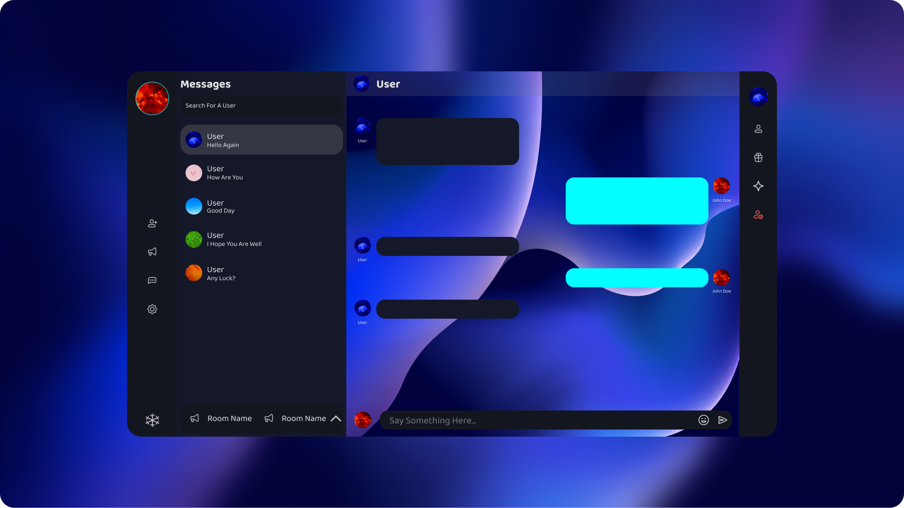

# Chat-App
A real time chat application done with tauri and react with a firebase backend

# I am a user/tester
Executables for windows and linux is available <a href="https://github.com/waveyboym/Chat-App/releases">here</a> \
Executable for MacOS will be coming soon...

# I am a developer
1. Setup Tauri on your desktop following the instructions here <a href="https://tauri.app/v1/guides/getting-started/prerequisites">set up tauri</a>. Only set up Tauri to make sure you fullfil the requirements. Don't create a new project, that is don't go to the page beyond the prerequisites page.
2. Once Tauri has been set up, clone this repo.
3. From your terminal where you cloned this repo, run: 
```
cd "Chat-App/Fiddle Chat App"
```
4. Run
```
npm install
```
5. You will also now have to set up firebase and create a secrets file in the root directory. Have a look at <a href="#setting-up-firebase">Setting up firebase</a> to set up a firebase project.
6. Once that is completed, you can run: 
```
npm run tauri dev
```
7. Please note that by default, the application will launch as a frame-less window. If you want to change that, follow the instructions for changing that under <a href="#change-app-window-between-frame-less-and-not-frame-less">Change App window from frame-less to not frame-less</a>

# Setting up firebase
1. To set up firebase, navigate to <a href="https://firebase.google.com/docs/web/setup?authuser=0#add-sdk-and-initialize">firebase setup</a> and follow the instructions.
2. Once you have created a new project, add your <a href="https://firebase.google.com/docs/web/learn-more?authuser=0#config-object">Firebase project configuration</a> into an ```.env``` file. The ```.env``` file must reside at the root of the application, which is <a href="https://github.com/waveyboym/Chat-App/tree/main/Fiddle%20Chat%20App">this directory</a>
3. The contents that you must place in the ```.env``` file are as follows:
```
VITE_APIKEY=<Your firebase api key goes here and remove the angle brackets>
VITE_AUTHDOMAIN=<Your firebase auth domain goes here and remove the angle brackets>
VITE_PROJECTID=<Your firebase project id goes here and remove the angle brackets>
VITE_STORAGEBUCKET=<Your firebase storage bucket goes here and remove the angle brackets>
VITE_MESSAGINGSENDERID=<Your firebase messaging sender id goes here and remove the angle brackets>
VITE_APPID=<Your firebase app id goes here and remove the angle brackets>
VITE_MEASUREMENTID=<Your firebase measurement id goes here and remove the angle brackets>
VITE_GOOGLECLIENTID=<Your firebase google client id goes here and remove the angle brackets>
VITE_GITHUBCLIENTID=<This can be left empty as github login does not yet work fully>
```
4. Now add support for google, github and email and password authentication. According to firebase docs, the instructions for that are as follows:
```
**Enable Google as a sign-in method in the Firebase console:**
    **In the Firebase console, open the Auth section.**
    **On the Sign in method tab, enable the Google sign-in method and click Save**
The process for adding other sign-in methods is pretty much the same.
```
       
5. To set up a database, follow the instructions here: <a href="https://firebase.google.com/docs/database/web/start?hl=en&authuser=0#create_a_database">setting up a database</a>
6. create a collections in the database and name it "users" and add a document. It can be empty document; it is more so as a placeholder and you can delete it once your database has been populated with other users.
7. Create a storage for your database. This allows users to store their profile pictures. The instructions for that are here: <a href="https://firebase.google.com/docs/storage/web/start?hl=en&authuser=0">creating a storage</a>
8. (Optional) You can add rules to restrict access to your database and make it more secure otherwise firebase will continuously send you emails about this. Just know if you don't add rules, anyone can access your database. The rules I used for my database are as follows:
```
rules_version = '2';
service cloud.firestore {
  match /databases/{database}/documents {
    match /{document=**} {
      allow read, write: if request.auth != null && get(/databases/$(database)/documents/users/$(request.auth.uid)).data.AccountActive == true
    }
  }
}
```
9. more information about rules in your database: https://firebase.google.com/docs/firestore/security/get-started

# Change App window between frame-less and not frame-less
1. Open <a href="https://github.com/waveyboym/Chat-App/blob/main/Fiddle%20Chat%20App/src-tauri/tauri.conf.json">tauri.conf.json</a> and select delete everything in the file.
2. For a frameless window, open <a href="https://github.com/waveyboym/Chat-App/blob/main/Fiddle%20Chat%20App/src-tauri/tauri-frameless.txt">tauri-frameless.txt</a> and select, copy and paste everything into <a href="https://github.com/waveyboym/Chat-App/blob/main/Fiddle%20Chat%20App/src-tauri/tauri.conf.json">tauri.conf.json</a>
3. For a non-frameless window, open <a href="https://github.com/waveyboym/Chat-App/blob/main/Fiddle%20Chat%20App/src-tauri/tauri-noframe.txt">tauri-noframe.txt</a> and select, copy and paste everything into <a href="https://github.com/waveyboym/Chat-App/blob/main/Fiddle%20Chat%20App/src-tauri/tauri.conf.json">tauri.conf.json</a>

# Adding more colour themes
1. To add another colour theme, first go to <a href="https://github.com/waveyboym/Chat-App/blob/main/Fiddle%20Chat%20App/src/components/sub_components/Themes.tsx">Themes.tsx</a> and go to a line after the last "theme-selector" div and paste the following replacing "light-yellow-col | dark-yellow-col" and "lyellow | dyellow" with the name of your colour and the text in between h3 tags with the name of your colour to display:
```
<div className="theme-selector">
            <motion.div 
              className={themeCol === "light-yellow-col" ? "colour-circle selected-colour-circle" : "colour-circle"}
              id="light-yellow-col" 
              whileHover={{scale: 1.03}} 
              whileTap={{scale: 0.97}} 
              onClick={() => changeThemeColours("light-yellow-col", "lyellow")}>
            </motion.div>
            <h3>Light yellow theme</h3>
          </div>
```
2. Go to <a href="https://github.com/waveyboym/Chat-App/blob/main/Fiddle%20Chat%20App/src/styles/Settings.scss">Settings.scss</a> and at line 448 add the class name of the theme-selector you created and it's corresponding colour, eg ```#light-yellow-col{background: #f8e962;}```
3. Go to <a href="https://github.com/waveyboym/Chat-App/blob/main/Fiddle%20Chat%20App/src/styles/_constantMixins.scss">_constantMixins.scss</a>
4. If you colour is a dark colour, copy a block that has a colour starting with such as ```[data-theme='dgreen']```. If is light, copy ```[data-theme='lgreen']```.
5. Name ```[data-theme='dgreen']``` with the name of your colour, eg ```[data-theme='lyellow']```. Make sure this matches otherwise the colours won't reflect when you change the theme.
6. Change the three variables, \
    --root-dark-side-bar-col, \
    --root-top-most-app-draggable-sec and  \
    --root-lighter-side-bar-col by adjusting their colours in the section of code you just copied over to suit your needs.

# Note
This branch is done with tauri. The old version which is done with electron is accessible here: https://github.com/waveyboym/Chat-App/tree/read-only-old-version.
The old version will no longer receive updates and/or fixes. I'm just putting it up in case anyone might want to have access to it.

 # TODO
- [ ] Improve load times between opening messages
- [x] Improve user interface for navigating between private messages and room message
- [x] Add support for presence detection(whether or not a user is online)
- [x] Add ability to view all friends in a separate component
- [ ] Add stories/most recent updates
- [x] Maybe add more themes

# Technologies & Tools used and npm packages
1. Tauri: https://tauri.app/
2. Figma(for designing the UI): https://github.com/figma
3. SCSS: https://github.com/sass/sass
4. Framer Motion(Animations and transitions): https://github.com/framer/motion
5. Material UI: https://github.com/mui/material-ui
6. Emoji-Mart: https://github.com/missive/emoji-mart
7. Firebase: https://github.com/firebase/
8. React-colorful: https://github.com/omgovich/react-colorful
9. React-loader-spinner: https://github.com/mhnpd/react-loader-spinner
11. Use-local-storage: https://github.com/nas5w/use-local-storage
12. Icon pack(Basil Icons): https://www.figma.com/community/file/931906394678748246

# Images used in presentation
1. https://unsplash.com/photos/ruJm3dBXCqw
2. https://unsplash.com/photos/PGdW_bHDbpI
3. https://unsplash.com/photos/m_7p45JfXQo
4. https://unsplash.com/photos/nY14Fs8pxT8
