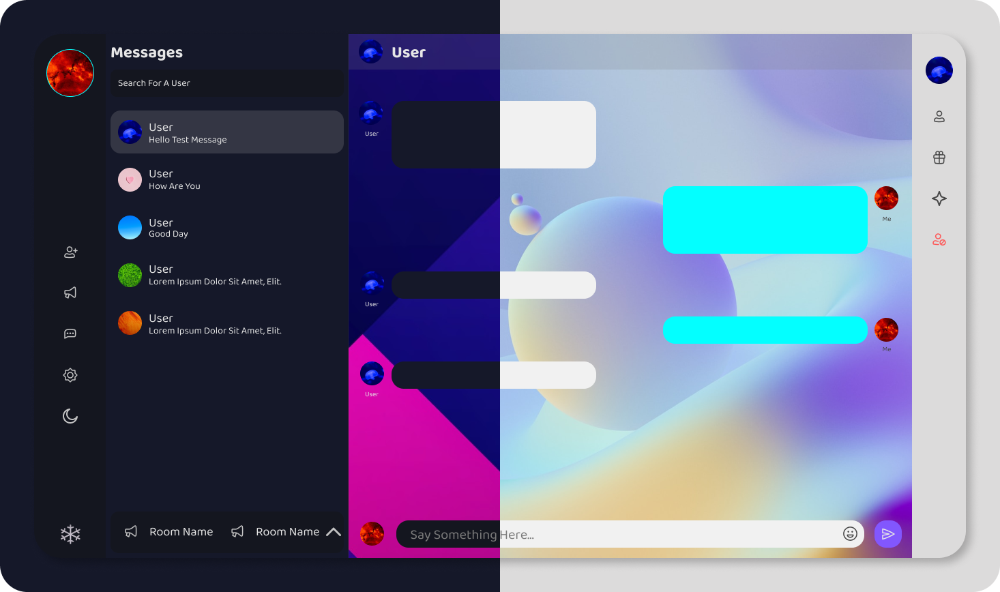
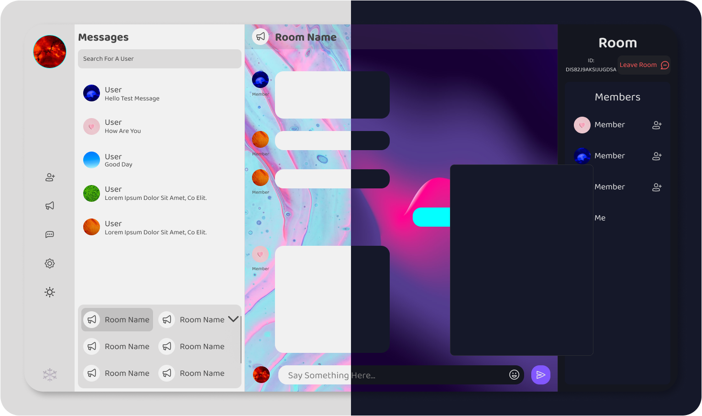

# Chat-App
A real time chat application done with tauri and react with a firebase backend

# Note
This branch is done with tauri. The old version which is done with electron is accessible here: https://github.com/waveyboym/Chat-App/tree/read-only-old-version.
The old version will no longer receive updates and/or fixes. I'm just putting it up in case anyone might want to have access to it.

# Presentation

\
\
\
\


# Technologies & Tools used and npm packages
1. Tauri: https://tauri.app/
2. Figma(for designing the UI): https://github.com/figma
3. SCSS: https://github.com/sass/sass
4. Framer Motion(Animations and transitions): https://github.com/framer/motion
5. Material UI: https://github.com/mui/material-ui
6. Emoji-Mart: https://github.com/missive/emoji-mart
7. Firebase: https://github.com/firebase/
8. React-colorful: https://github.com/omgovich/react-colorful
9. React-loader-spinner: https://github.com/mhnpd/react-loader-spinner
11. Use-local-storage: https://github.com/nas5w/use-local-storage
12. Icon pack(Basil Icons): https://www.figma.com/community/file/931906394678748246

# I am a user/tester
Executable for MacOS, Linux and Windows will be coming soon...

# I am a developer
1. Setup Tauri on your desktop following the instructions here <a href="https://tauri.app/v1/guides/getting-started/prerequisites">set up tauri</a>
2. Once Tauri has been set up, download the source files for your operating system from this repository. So if you use <a href="https://github.com/waveyboym/Chat-App/tree/main/Fiddle%20Chat%20App%20src%20files(windows-os)">windows-os</a> or if you use macos or linux(coming soon).
3. If you do not have node js installed on your computer, install it here <a href="https://nodejs.org/en/download/">nodejs</a>
4. Open a terminal where the folder that you just downloaded is located and run ```npm install```
5. Once all of the node modules have been installed, run ```npm install --save-dev @tauri-apps/cli```
6. Setting up firebase, since firebase has not been set up, you will not be able to get past the signup/login page once the app is launched. To set up firebase, follow the instructions below titled under "Setting up firebase".
7. Once that is completed, you can start a development server by running: ```npm run tauri dev```

# Setting up firebase
1. To set up firebase, navigate to <a href="https://firebase.google.com/docs/web/setup?authuser=0#add-sdk-and-initialize">firebase setup</a> and follow the instructions.
2. Once you have created a new project, add your <a href="https://firebase.google.com/docs/web/learn-more?authuser=0#config-object">Firebase project configuration</a> into the file <a href="https://github.com/waveyboym/Chat-App/blob/main/Fiddle%20Chat%20App%20src%20files(windows-os)/src/firebase.js">firebase.js</a> that came from this repository when you downloaded the source files.
3. Now add support for google, facebook, twitter, github and email and password authentication. According to firebase docs, the instructions for that are as follows:\
       **Enable Google as a sign-in method in the Firebase console:**\
       **In the Firebase console, open the Auth section.**\
       **On the Sign in method tab, enable the Google sign-in method and click Save**\
   The process for adding other sign-in methods is pretty much the same.
4. To set up a database, follow the instructions here: <a href="https://firebase.google.com/docs/database/web/start?hl=en&authuser=0#create_a_database">setting up a database</a>
5. create a collections in the database and name it "users" and add a document. It can be empty document; it is more so as a placeholder and you can delete it once your database has been populated with other users.
6. Create a storage for your database. This allows users to store their profile pictures. The instructions for that are here: <a href="https://firebase.google.com/docs/storage/web/start?hl=en&authuser=0">creating a storage</a>
7. You should now be done
8. The rules I used for this database:
```
rules_version = '2';
service cloud.firestore {
  match /databases/{database}/documents {
    match /{document=**} {
      allow read, write: if request.auth != null && get(/databases/$(database)/documents/users/$(request.auth.uid)).data.AccountActive == true
    }
  }
}
```
more information about rules in your database: https://firebase.google.com/docs/firestore/security/get-started

 # TODO
1. Improve load times between opening messages
2. Improve user interface for navigating between private messages and room messages
3. Add support for presence detection(whether or not a user is online)
4. Add ability to view all friends in a separate component 
5. Add stories/most recent updates
6. Maybe add more themes

# Images used in presentation
1. https://unsplash.com/photos/ruJm3dBXCqw
2. https://unsplash.com/photos/PGdW_bHDbpI
3. https://unsplash.com/photos/m_7p45JfXQo
4. https://unsplash.com/photos/nY14Fs8pxT8
